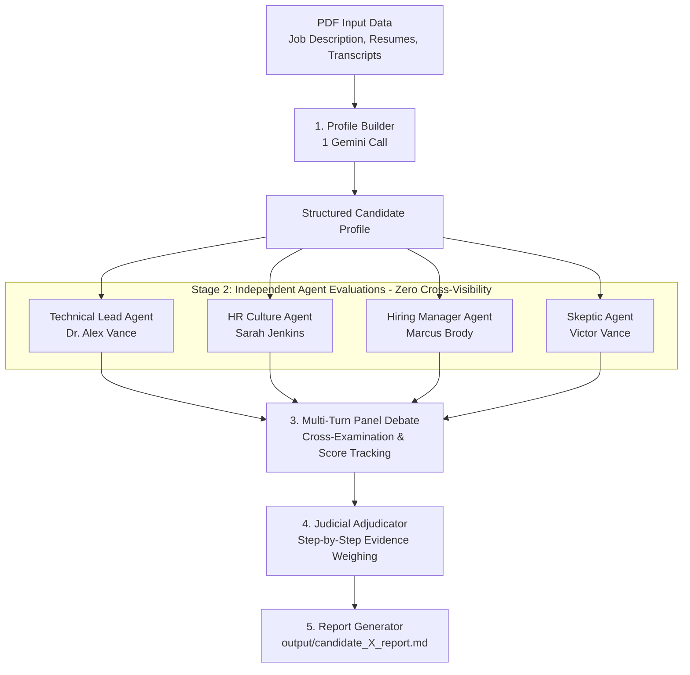

# Multi-Agent AI Interview Panel Simulator 🤖📋

A production-grade Python system powered by the **Google Gemini API (`google-genai` SDK)** that simulates an executive AI interview panel evaluating candidates for specialized roles. 

The simulator features structured fact extraction, **4 strictly independent agent personas**, a **turn-based cross-examination debate module** with traceable score shifts, an **evidence-weighing judicial arbitrator** (non-averaging decision engine), and automated **markdown report generation**.

---

## 🏗️ Architecture & Pipeline Flow



---

## 🔒 1. Strict Agent Independence Enforcement

Before any debate occurs, all 4 agent personas evaluate the candidate **in total isolation**:

- **Zero Cross-Visibility:** No agent prompt contains another agent's output or conclusions during initial evaluation. These are 4 fully separate Gemini API calls.
- **Pydantic Structured Output:** Responses strictly adhere to the `AgentEvaluation` schema using `google-genai`'s native JSON response schema (`response_mime_type="application/json"`).
- **Mandatory Quote Citation:** Every score and claim must cite exact verbatim evidence quotes tagged with `source: "resume" | "transcript"`.
- **Insufficient Info Flags:** If key information in an agent's domain is missing or unverified, agents explicitly populate `insufficient_info_flags` rather than making up assumptions.

### Agent Personas:
1. **Technical Lead Agent:** Focuses on engineering depth, system design, framework mastery, and technical reasoning.
2. **HR Culture Agent:** Evaluates communication clarity, teamwork attitude, emotional intelligence, and transparency.
3. **Hiring Manager Agent:** Evaluates overall hire-worthiness, execution ability, business ROI, and alignment with job deliverables.
4. **Skeptic Agent (Red-Flag Investigator):** Actively checks for inconsistencies between resume claims and transcript answers, exaggerated metrics, and unproven claims.

---

## ⚔️ 2. Turn-Based Debate & Traceable Score Shifts

Once independent evaluations are collected, the agents engage in a turn-based cross-examination debate:

- **Targeted Cross-Examination:** One agent's specific claims or skeptic red flags are presented to another agent to prompt a rebuttal, agreement, or defense.
- **Traceable Logged State:** Every turn logs:
  ```json
  {
    "agent": "Technical Lead Agent",
    "target_agent": "Skeptic Agent",
    "topic": "Rebuttal on technical evidence and project complexity",
    "message": "...",
    "changed_opinion": true,
    "previous_score": 8,
    "new_score": 7,
    "revised_confidence": "medium"
  }
  ```
- **Opinion Shifts:** Any shift in score or confidence between pre-debate and post-debate states is logged and highlighted in the final report.

---

## ⚖️ 3. Judicial Adjudication (No Simple Score Averaging)

The final hiring recommendation is generated by the **Judge Module** (`judge.py`):

- **Non-Averaging Logic:** The system strictly avoids averaging numerical scores (e.g., `(8 + 7 + 6 + 4) / 4`).
- **Step-by-Step Evidence Weighing:** The Judge evaluates the strength of cited evidence quotes, checks whether skeptic red flags were resolved or validated during debate, and compares candidate capabilities against the Job Description.
- **Verdict Categories:** Emits a final decision (`Strong Hire`, `Hire`, `Weak Hire`, or `No Hire`), confidence level, key deciding evidence quotes, and unresolved panel disagreements.

---

## 🛠️ Setup Instructions

### Prerequisites
- Python 3.10+ installed
- A Gemini API Key from [Google AI Studio](https://aistudio.google.com/)

### 1. Create Virtual Environment
```bash
# Windows
python -m venv .venv
.venv\Scripts\activate

# Linux / macOS
python3 -m venv .venv
source .venv/bin/activate
```

### 2. Install Dependencies
```bash
pip install -r requirements.txt
```

### 3. Configure Environment Variables
Copy `.env.example` to `.env` and set your API key:
```bash
# Windows PowerShell
copy .env.example .env

# Linux / macOS
cp .env.example .env
```

Edit `.env`:
```env
GEMINI_API_KEY=your_actual_gemini_api_key_here
GEMINI_MODEL=gemini-3.6-flash
```

---

## 🚀 How to Run

### Option 1: Interactive Streamlit Web UI
Launch the interactive dashboard to evaluate Candidate A, Candidate B, or Both:

```bash
streamlit run streamlit_app.py
```

### Option 2: Command-Line Interface (CLI)
Run the end-to-end multi-agent pipeline from terminal:

```bash
python main.py
```

### Option 3: Run Unit Tests (Fast & Offline)
Run unit tests with pytest:

```bash
pytest
```

### Generated Output Reports
The pipeline reads input PDFs from `data/` (`02_Job_Description.pdf`, candidate resumes, and interview transcripts) and writes candidate evaluation reports to:
- [`output/candidate_A_report.md`](file:///c:/Users/User/Desktop/PromptWars/multi-agent-interview-panel/output/candidate_A_report.md)
- [`output/candidate_B_report.md`](file:///c:/Users/User/Desktop/PromptWars/multi-agent-interview-panel/output/candidate_B_report.md)

---

## 📁 Repository Structure

```
multi-agent-interview-panel/
├── .env.example                # Template for environment configuration
├── .gitignore                   # Ignore rules (.env, venv/, output/, __pycache__/)
├── requirements.txt             # Python dependencies (google-genai, pypdf, python-dotenv, pydantic)
├── data/                        # PDF files (Job Description, Resumes, Transcripts)
├── utils/
│   ├── __init__.py
│   └── pdf_reader.py           # PDF raw text extraction via pypdf
├── profile_builder.py           # Structured profile extraction (1 Gemini call)
├── agents/
│   ├── __init__.py
│   ├── base_agent.py            # Base agent class & Pydantic response schemas
│   ├── technical_agent.py       # Technical Lead persona
│   ├── hr_agent.py              # HR Culture persona
│   ├── hiring_manager_agent.py  # Hiring Manager persona
│   └── skeptic_agent.py         # Skeptic/Red Flag persona
├── debate.py                    # Turn-based debate orchestrator & score shift tracker
├── judge.py                     # Non-averaging step-by-step evidence weighing judge
├── report.py                    # Markdown report generator
└── main.py                      # CLI entry point and pipeline orchestrator
```
